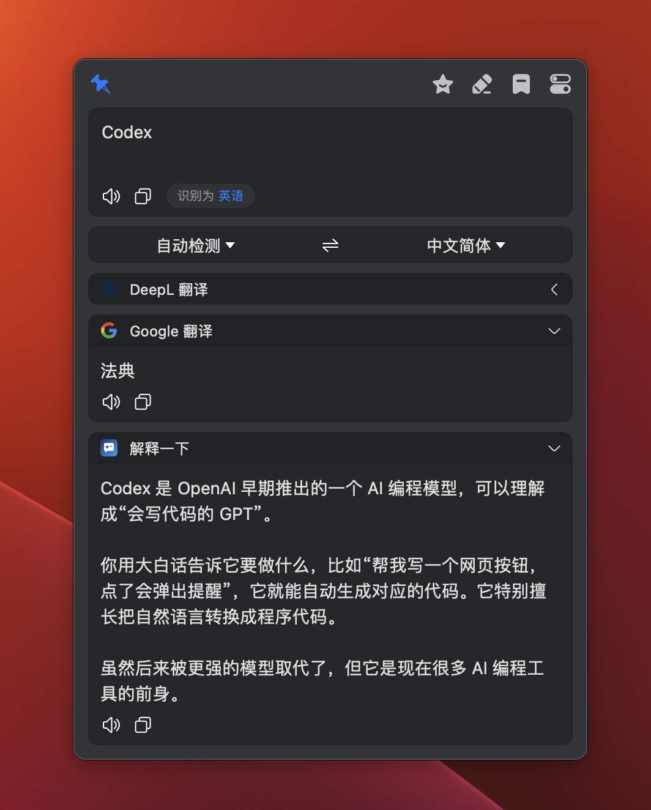

# 解释一下 - Bob 插件

> [Bob](https://github.com/ripperhe/Bob) 划词翻译插件：选中任意文本，调用大模型「用通俗易懂又简洁的话解释下」。

本插件面向 **Bob 社区免费版**，支持任意 OpenAI 兼容或 Anthropic 兼容的接口——云端服务（OpenAI / DeepSeek / 智谱等）或本地模型（Ollama / LM Studio / 各类代理网关）都可以。



## 功能

- 选中任意文本，按 **option + d**（划词翻译快捷键）即可让大模型解释这段文字
- **自定义 Prompt**：默认「用通俗易懂又简洁的话解释下：$text」，可任意改写
- **自定义接口**：OpenAI 兼容（`/chat/completions`）与 Anthropic 兼容（`/messages`）两种格式
- **流式兼容**：始终以流式（SSE）方式请求，支持只提供流式输出的本地服务
- **连接测试**：翻译 `test` 或 `测试` 一词即可验证配置是否正确

## 安装

1. 前往 [Releases](https://github.com/ifyour/bobplugin-explain/releases) 下载最新的 `bobplugin-explain-vX.X.X.bobplugin` 文件
2. 双击文件，Bob 会自动安装
3. 打开 Bob 偏好设置 → 服务 → 文本翻译，找到「解释一下」

> 要求：Bob 社区免费版 0.5.0 及以上。

## 配置

在 Bob 偏好设置 → 服务 → 文本翻译 → 解释一下 → 设置 中填写：

| 配置项 | 说明 | 示例 |
| --- | --- | --- |
| 接口地址 | OpenAI 或 Anthropic 兼容的完整请求地址 | 见下方示例 |
| 接口类型 | OpenAI 兼容 / Anthropic 兼容 | Anthropic 格式使用 `x-api-key` 请求头 |
| API Key | 服务密钥，本地模型通常留空 | `sk-...` |
| 模型名称 | 取决于你的服务端点 | `gpt-4o-mini`、`deepseek-chat`、`wb-deepseek-v4-pro` |
| 用户指令 | Prompt 模板，`$text` 会被替换为选中文本，`$to` 为目标语言 | `用通俗易懂又简洁的话解释下：$text` |

### 常见端点示例

| 服务 | 接口地址 | 接口类型 |
| --- | --- | --- |
| OpenAI | `https://api.openai.com/v1/chat/completions` | OpenAI 兼容 |
| DeepSeek | `https://api.deepseek.com/v1/chat/completions` | OpenAI 兼容 |
| Ollama 本地模型 | `http://localhost:11434/v1/chat/completions` | OpenAI 兼容 |
| Anthropic 格式的本地网关 | `http://127.0.0.1:8317/v1/messages` | Anthropic 兼容 |

## 测试配置是否正确

在任意输入框输入 `test`（或 `测试`），选中它，按 option + d。插件会发送一条测试请求并显示：

```
✅ 连接成功
端点: http://127.0.0.1:8317/v1/messages
类型: anthropic  模型: wb-deepseek-v4-pro
回复预览: ok
```

失败时会显示具体的错误信息（网络错误 / 状态码 / 接口报错），方便排查。

## 使用示例

- 默认指令：选中一段代码或术语 → option + d → 得到通俗解释
- 换个玩法，把「用户指令」改成：
  - `把下面的文字润色得更专业：$text`
  - `总结这段话的三个要点：$text`
  - `把这段话翻译成英文并解释其中的俚语：$text`

## 本地开发

```bash
npm install        # 安装依赖
npm run build      # 打包，产物在 dist/ 目录
npm run dev        # 开发模式（watch）
python3 scripts/gen-icon.py  # 重新生成图标（需 Pillow）
```

## 致谢

- 基于 [tingv/bobplugin-google-translate](https://github.com/tingv/bobplugin-google-translate) 的工程脚手架
- 灵感来自 [@vista8](https://x.com/vista8/status/2102431061959663843) 分享的「解释一下」插件

## License

[MIT](LICENSE)
